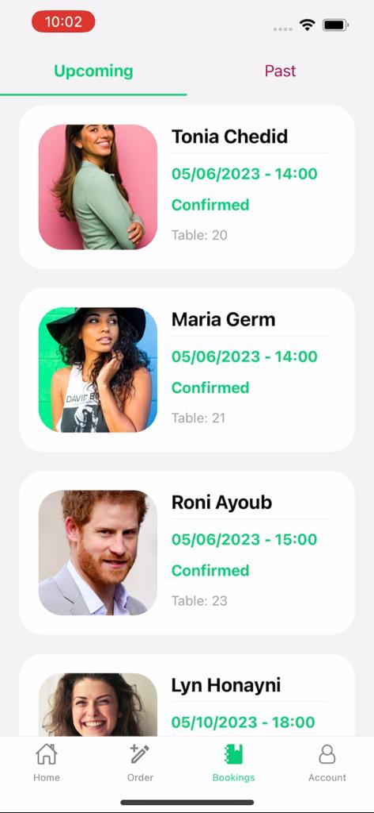

# Plateful (Restaurant Management System)


## Description
Plateful is a mobile app built with React Native that allows users to browse through restaurants, view information such as images, contact info, menu, add and view reviews, and place reservations for specific tables at those restaurants. Users will be presented with an interactive UI that represents the layout of the restaurant, which was inferred from the restaurant's floor map using YoloV5 to perform object detection.

Staff and managers can also log into their accounts to edit information related to their restaurant, view an NLP analysis of the reviews, and take orders for their tables. Furthermore, managers can assign staff accounts to their . The NLP model is based on our trained SVMs and OpenAI's GPT API to classify the topics mentioned in the review as well as the sentiment of the user.

## Table of Contents
[Installation](#Installation)  
[Usage](#Usage)  
[Features](#Features)  
[Contributing](#Contributing)  
[License](#License)  

## Installation
To get started with *Plateful*, follow these steps:
1. Clone this repository
2. Run **`npm install`** to install dependencies
3. Run **`npm start`** to start the development server
4. Refer to [this repo](https://github.com/anthonySemaan01/Restaurant-Management) to install the necessary backend logic to interface with the app

## Technologies Used
- React Native (JavaScript)
- GPT 
- YoloV5
- Jupyter Notebook
- Python (sklearn, pandas, numpy)

## Project Structure
```bash
.
├── src
│   ├── api
│   ├── components
│   ├── context
│   ├── hooks
│   ├── screens
│   └── constants.js
│     
├── demos  
│   ├── screenshots
│   └── videos
│     
├── assets
│   └── fonts
│
├── models
│   └── notebooks
│       └── Topic_Sentiment_Classification.ipynb
|  
├── App.js
```


## Usage
In the root directory of the project, type the following command in the terminal
`**npm start**`

Then open Expo Go on your mobile and scan the QR code presented in the terminal.

To check the notebook of the trained SVMs, refer to the *models* folder. The dataset used (Yelp) can be downloaded through [this link](https://www.yelp.com/dataset)


## Screenshots
### User Flow
#### Sign Up
 


#### Browsing, Booking, Reviewing


#### Account Information


### Manager Flow





### Staff Flow


## Demo
For full video demos, refer to the demos folder.

## Acknowledgements
- [Antonio Chedid](https://github.com/t0t0-01), Lebanese American University, Byblos, Lebanon
- [Anthony Semaan](https://github.com/anthonySemaan01), Lebanese American University, Byblos, Lebanon


